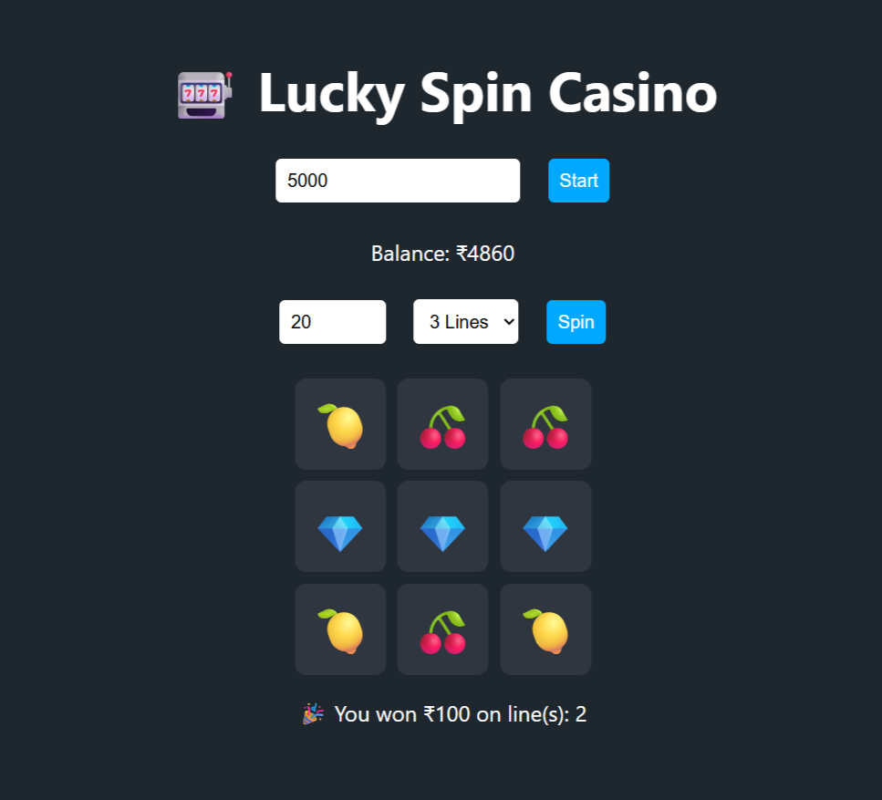

# 🎰 Lucky Spin - Web Casino Game
Welcome to *Lucky Spin*, a fun and interactive casino game brought to life in your browser using HTML, CSS, and JavaScript! Inspired by the classic terminal-based Python game, this version adds a beautiful UI with animations and sound effects for an exciting gaming experience.

## View Demo...👇

[**Play the Game Here**](https://vignesh-kandem.github.io/Casino/)

## 🎮 Game Features

- 🎰 Random symbol generation
- 🎯 3x3 Slot machine interface
- 📈 Simulated odds for realism
- 🎲 Multiple spin options
- 🧮 Score & balance tracking
- 💸 Winnings and betting logic
- ⚠️ Insufficient balance & empty wallet alerts

## 🧰 Technologies Used

| Technology | Purpose |
|------------|---------|
| Javascript | Performing random spin generator | 
| css | Adding styles to the interface |
| HTML | Page structure and Interface |

## 📦 Installation

Clone this repository:

```bash
git clone https://github.com/Vignesh-Kandem/Casino
cd Casino
```

## 🖼 Project Screenshot

